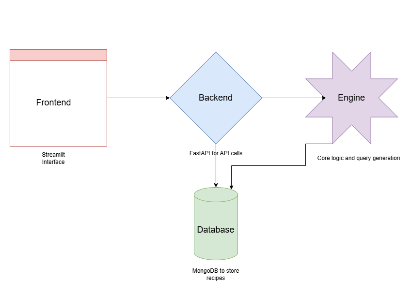

#  🥘Baker

This contains the source code for [Baker](https://github.com/VianneyMI/baker). A tool that allows you to find recipes based on a list of ingredients and a serving size and hopefully helps you avoid food waste.

I wrote an article that explain the backstory of the project [here](https://towardsdatascience.com/transforming-data-into-solutions-building-a-smart-app-with-python-and-ai-c258be3b1fc2).

In the article, I explain the motivation for the project, the challenges, the development process and the future of the project.

## Installation

In order to reuse the code or to reproduce the results, you need to install the required libraries. You can install the required libraries by running the following command:

```bash

pip install -r requirements.txt

```

or using docker:

```bash

docker build -t baker .
docker run -p 8000:8000 baker

```

## Application Architecture



## Contributing

You can  raise issues or pull requests on the [GitHub repo](https://github.com/VianneyMI/baker/issues) if you have any suggestions or improvements, you can also comment the article on [Towards Data Science](https://towardsdatascience.com/the-lesser-known-rising-application-of-llms-775834116477).

## License

This project is licensed under the MIT License - see the [LICENSE](https://github.com/VianneyMI/baker/blob/main/LICENSE)